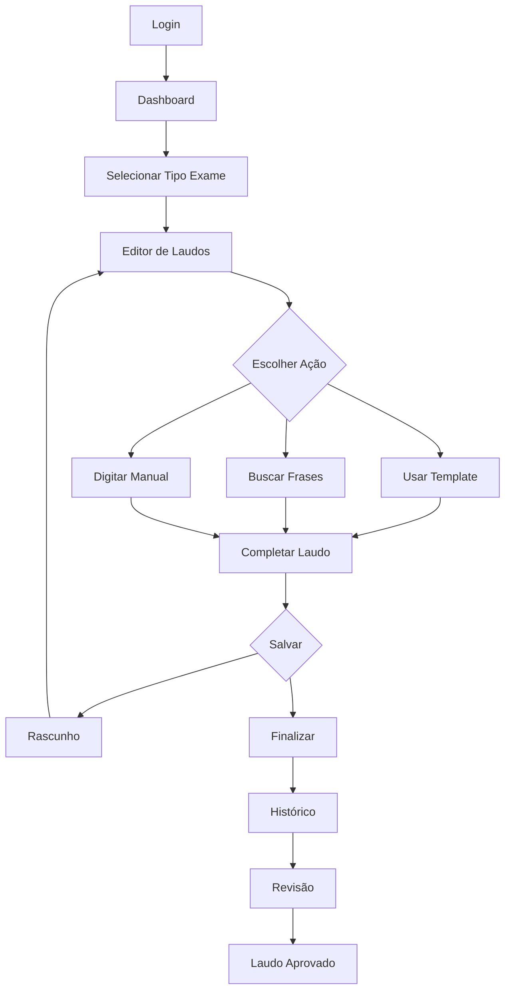

## 1. Product Overview
Ferramenta especializada para criação e gerenciamento de laudos radiológicos com interface intuitiva e banco de frases categorizadas. Otimiza o tempo dos radiologistas através de templates personalizáveis e histórico de laudos.

Desenvolvida para clínicas e hospitais que necessitam de agilidade e padronização na elaboração de laudos médicos, garantindo conformidade com as normas médicas brasileiras.

## 2. Core Features

### 2.1 User Roles
| Role | Registration Method | Core Permissions |
|------|---------------------|------------------|
| Radiologista | Admin registration | Criar, editar e finalizar laudos |
| Administrador | System initialization | Gerenciar usuários, templates e configurações |
| Revisor | Admin registration | Revisar e aprovar laudos |

### 2.2 Feature Module
O sistema de laudos radiológicos consiste nas seguintes páginas principais:
1. **Login**: autenticação segura com email e senha
2. **Dashboard**: navegação por tipos de exames e estatísticas
3. **Editor de Laudos**: interface com banco de frases e templates
4. **Histórico**: lista de laudos emitidos com filtros
5. **Configuração**: gestão de templates e preferências

### 2.3 Page Details
| Page Name | Module Name | Feature description |
|-----------|-------------|---------------------|
| Login | Formulário de autenticação | Valida email e senha com criptografia. Inclui recuperação de senha |
| Dashboard | Cards de exames | Exibe cards clicáveis para Ultrassonografia, Tomografia, Mamografia, Raio-X e ressonância |
| Dashboard | Menu lateral | Navegação para Laudos, Configuração, Histórico, Sair |
| Dashboard | Estatísticas rápidas | Mostra quantidade de laudos do dia/mês e pendências |
| Editor de Laudos | Navegação por abas | Alterna entre diferentes tipos de exames mantendo contexto |
| Editor de Laudos | Banco de frases | Árvore categorizada com frases pré-definidas drag-and-drop |
| Editor de Laudos | Editor de texto | Campo rich text com formatação básica e inserção de frases |
| Editor de Laudos | Templates | Seleção e aplicação de modelos de laudo por tipo de exame |
| Histórico | Lista de laudos | Tabela paginada com busca por paciente, data e tipo de exame |
| Histórico | Filtros avançados | Filtrar por período, tipo de exame e status de conclusão |
| Configuração | Gestão de templates | CRUD de modelos de laudo por especialidade |
| Configuração | Preferências do usuário | Personalizar interface e atalhos de teclado |

## 3. Core Process
### Fluxo do Radiologistas
1. Login com credenciais válidas
2. Dashboard mostra cards de tipos de exames disponíveis
3. Seleciona tipo de exame (ex: Tomografia)
4. Sistema abre editor com aba específica
5. Radiologista pode: usar template existente, buscar frases no banco ou digitar livremente
6. Completando laudo, salva como rascunho ou finaliza
7. Se finalizado, laudo fica disponível no histórico

### Fluxo do Revisor
1. Acessa histórico de laudos pendentes
2. Seleciona laudo para revisão
3. Faz alterações necessárias
4. Aprova ou solicita correções

## 4. User Interface Design
### 4.1 Design Style
- **Cores primárias**: Azul médico (#1976D2) e branco
- **Cores secundárias**: Verde sucesso (#4CAF50) e vermelho alerta (#F44336)
- **Estilo de botões**: Rounded corners com sombra suave
- **Fonte**: Roboto para melhor legibilidade médica
- **Tamanhos**: 14px corpo, 16px headers, 12px labels
- **Layout**: Card-based com navegação lateral fixa
- **Ícones**: Material Design Icons para consistência médica

### 4.2 Page Design Overview
| Page Name | Module Name | UI Elements |
|-----------|-------------|-------------|
| Login | Form container | Card centralizado com logo, campos de entrada com ícones, botão primário azul |
| Dashboard | Cards grid | Grid responsivo 3x2, cards com ícones médicos e contagens de laudos |
| Dashboard | Sidebar | Lateral esquerda fixa 250px, menu hierárquico com ícones |
| Editor | Split view | Divisão 70/30 entre editor e banco de frases, barra de ferramentas superior |
| Histórico | Data table | Tabela com zebra striping, ordenação por colunas, paginação inferior |

### 4.3 Responsiveness
- **Desktop-first**: Otimizado para telas 1920x1080 (principal uso)
- **Mobile-adaptive**: Suporte básico para tablets em modo paisagem
- **Touch optimization**: Botões grandes (48px mínimo) para uso com luvas
- **Print-friendly**: Versão impressão otimizada para laudos físicos