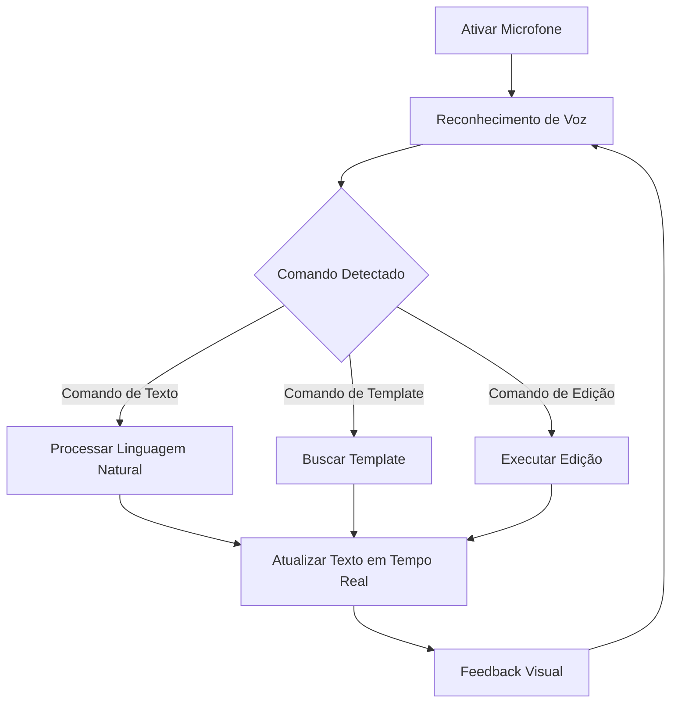

## 1. Visão Geral do Produto

Sistema de geração e edição inteligente de laudos radiológicos com reconhecimento de voz e assistência por IA. Otimiza o fluxo de trabalho dos radiologistas, permitindo criação rápida e precisa de laudos através de comandos de voz, templates inteligentes e sugestões contextuais baseadas em IA.

**Valor de Mercado:** Redução de até 70% no tempo de elaboração de laudos, aumentando a produtividade e precisão diagnóstica.

## 2. Funcionalidades Principais

### 2.1 Papéis de Usuário

| Papel | Método de Registro | Permissões Principais |
|-------|-------------------|---------------------|
| Radiologista | Registro via email + CRM | Acesso completo: editor, voz, templates, banco de dados |
| Assistente | Convite do radiologista | Edição limitada, sem acesso a configurações avançadas |
| Administrador | Registro direto | Gerenciamento de usuários, templates e sistema |

### 2.2 Módulos de Funcionalidades

**Páginas essenciais do sistema:**

1. **Editor de Laudos Inteligente**: interface de edição focada em texto, copiar/colar modelos, salvamento de templates
2. **Painel de Comandos de Voz**: controle de reconhecimento de voz, status de processamento
3. **Biblioteca de Templates**: gestão de modelos pré-cadastrados e personalizados
4. **Banco de Dados Contextual**: terminologia radiológica, sugestões automáticas
5. **Dashboard Principal**: visão geral de laudos, estatísticas e acessos rápidos

### 2.3 Detalhes das Páginas

| Nome da Página | Módulo | Descrição das Funcionalidades |
|----------------|---------|------------------------------|
| Editor de Laudos | Interface de Edição | Editor de texto limpo sem formulários, suporte a formatação médica, atalhos de teclado, salvamento automático |
| Editor de Laudos | Templates Rápidos | Copiar/colar modelos pré-cadastrados, inserção com comandos de voz, categorização por modalidade |
| Editor de Laudos | Templates Personalizados | Criar, salvar e gerenciar templates customizados, compartilhamento entre equipe |
| Painel de Comandos | Reconhecimento de Voz | Ativar/desativar microfone, indicador visual de gravação, ajuste de sensibilidade |
| Painel de Comandos | Processamento de Linguagem | Comandos naturais em português, interpretação de contexto médico, correção automática |
| Painel de Comandos | Atualização em Tempo Real | Texto atualizado instantaneamente via voz, feedback visual de comandos processados |
| Biblioteca de Templates | Gestão de Modelos | Busca inteligente, filtros por especialidade, preview de templates, importação/exportação |
| Banco de Dados Contextual | Terminologia Radiológica | Banco completo de termos médicos, anatomia, patologias, procedimentos por modalidade |
| Banco de Dados Contextual | Sugestões Inteligentes | IA sugere termos baseados em contexto, aprendizado com uso do usuário, correções ortográficas |
| Dashboard | Visão Geral | Lista de laudos recentes, estatísticas de produtividade, acessos rápidos |
| Dashboard | Estatísticas | Tempo médio de laudo, uso de voz, templates mais utilizados, produtividade por período |

## 3. Fluxo Principal do Processo

### Fluxo do Radiologista
1. Login no sistema → Dashboard principal
2. Criar novo laudo ou abrir existente → Editor inteligente
3. Ativar reconhecimento de voz → Comandos de voz ativados
4. Ditatar laudo ou usar templates → Texto gerado automaticamente
5. Revisar e editar → Ferramentas de edição e sugestões
6. Salvar e exportar → Laudo finalizado

### Fluxo de Comandos de Voz

## 4. Design da Interface

### 4.1 Estilo de Design
- **Cores Primárias:** Azul médico (#0066CC), Branco (#FFFFFF)
- **Cores Secundárias:** Verde confirmação (#28A745), Vermelho alerta (#DC3545)
- **Estilo de Botões:** Arredondados com sombra suave, ícones médicos
- **Fontes:** Roboto para interface, monospace para editor de texto
- **Tamanhos:** 14px interface, 16px editor, 12px elementos secundários
- **Layout:** Baseado em cards com navegação lateral collapsible
- **Ícones:** Estilo line-art médico, consistentes com padrões hospitalares

### 4.2 Visão Geral das Páginas

| Página | Módulo | Elementos de UI |
|--------|---------|----------------|
| Editor | Área de Texto | Editor fullscreen com fundo branco, toolbar flutuante, linha de status com contador de palavras |
| Editor | Barra de Voz | Microfone animado quando ativo, waveform visual, botões de controle grandes e acessíveis |
| Editor | Painel de Templates | Sidebar collapsible com preview de templates, busca instantânea, categorias em accordion |
| Dashboard | Cards de Estatísticas | Cards com números grandes e gráficos circulares, cores baseadas em performance |
| Dashboard | Lista de Laudos | Tabela responsiva com status colorido, ações em dropdown, paginação inteligente |

### 4.3 Responsividade
- **Desktop-first:** Otimizado para telas grandes (1920x1080)
- **Mobile-adaptativo:** Funcional em tablets para mobilidade hospitalar
- **Touch-optimized:** Botões grandes para uso com luvas, gestos de voz prioritários
- **Performance:** Carregamento instantâneo, funcionamento offline