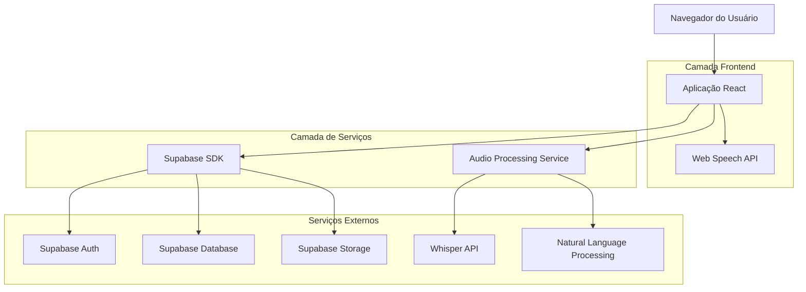
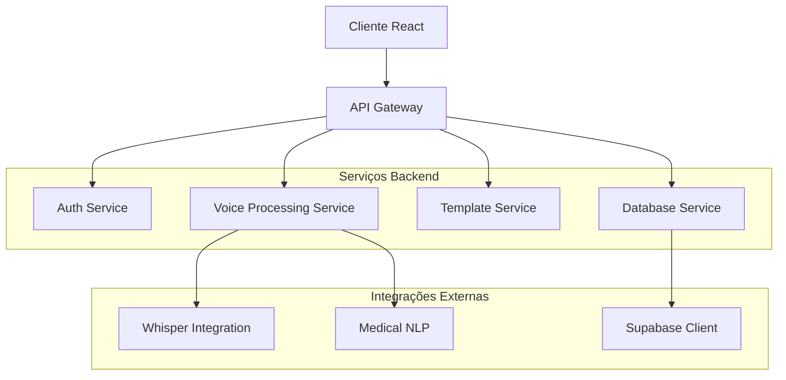

## 1. Arquitetura do Sistema



## 2. Stack Tecnológica

- **Frontend:** React@18 + TypeScript + Vite + TailwindCSS@3
- **Backend:** Supabase (BaaS) - Autenticação, Banco PostgreSQL, Storage
- **IA de Voz:** Web Speech API (navegador) + Whisper API (processamento avançado)
- **Processamento de Linguagem:** OpenAI GPT-4 para comandos médicos
- **Estado Global:** Zustand para gerenciamento de estado
- **Áudio:** Recorder.js para gravação, AudioContext para processamento em tempo real
- **Performance:** React.memo + useMemo para otimização de renderização

## 3. Definições de Rotas

| Rota | Propósito |
|------|-----------|
| / | Dashboard principal com estatísticas e laudos recentes |
| /editor | Editor de laudos com reconhecimento de voz integrado |
| /editor/:id | Editar laudo específico existente |
| /templates | Biblioteca de templates médicos |
| /templates/novo | Criar novo template personalizado |
| /database | Banco de dados contextual com terminologia médica |
| /settings | Configurações de usuário e preferências de voz |
| /login | Autenticação de usuários |
| /profile | Perfil do usuário e estatísticas pessoais |

## 4. Definições de API

### 4.1 APIs de Autenticação (Supabase)

```
POST /auth/v1/token
```
Autenticação de usuários com email e senha

Request:
```json
{
  "email": "radiologista@hospital.com",
  "password": "senha123"
}
```

### 4.2 APIs de Processamento de Voz

```
POST /api/voice/process
```
Processamento de áudio para texto com contexto médico

Request:
```json
{
  "audio_base64": "base64_encoded_audio",
  "context": "laudo_torax",
  "user_id": "uuid"
}
```

Response:
```json
{
  "transcription": "O paciente apresenta...",
  "confidence": 0.95,
  "medical_terms": ["paciente", "apresenta", "lesão"],
  "suggestions": ["lesão nodular", "apresenta sinais"]
}
```

### 4.3 APIs de Templates e Banco de Dados

```
GET /api/templates
```
Listar templates disponíveis com filtros

```
GET /api/database/terms
```
Buscar termos médicos com sugestões contextuais

```
POST /api/laudos
```
Criar novo laudo com processamento de IA

## 5. Arquitetura do Servidor



## 6. Modelo de Dados

### 6.1 Definição do Modelo de Dados

```mermaid
erDiagram
    USERS ||--o{ LAUDOS : creates
    USERS ||--o{ TEMPLATES : creates
    USERS ||--o{ VOICE_COMMANDS : issues
    LAUDOS ||--o{ LAUDO_VERSIONS : has
    TEMPLATES }o--o{ MEDICAL_TERMS : contains
    
    USERS {
        uuid id PK
        string email UK
        string name
        string crm
        string specialty
        json voice_preferences
        timestamp created_at
        timestamp last_active
    }
    
    LAUDOS {
        uuid id PK
        uuid user_id FK
        string patient_id
        string modality
        string body_part
        text content
        json metadata
        string status
        timestamp created_at
        timestamp updated_at
    }
    
    LAUDO_VERSIONS {
        uuid id PK
        uuid laudo_id FK
        text content
        json changes
        timestamp created_at
    }
    
    TEMPLATES {
        uuid id PK
        uuid user_id FK
        string name
        string category
        text content
        json variables
        boolean is_public
        timestamp created_at
    }
    
    VOICE_COMMANDS {
        uuid id PK
        uuid user_id FK
        string command_type
        text transcription
        json parameters
        float confidence
        timestamp created_at
    }
    
    MEDICAL_TERMS {
        uuid id PK
        string term
        string category
        string definition
        json synonyms
        json related_terms
        integer