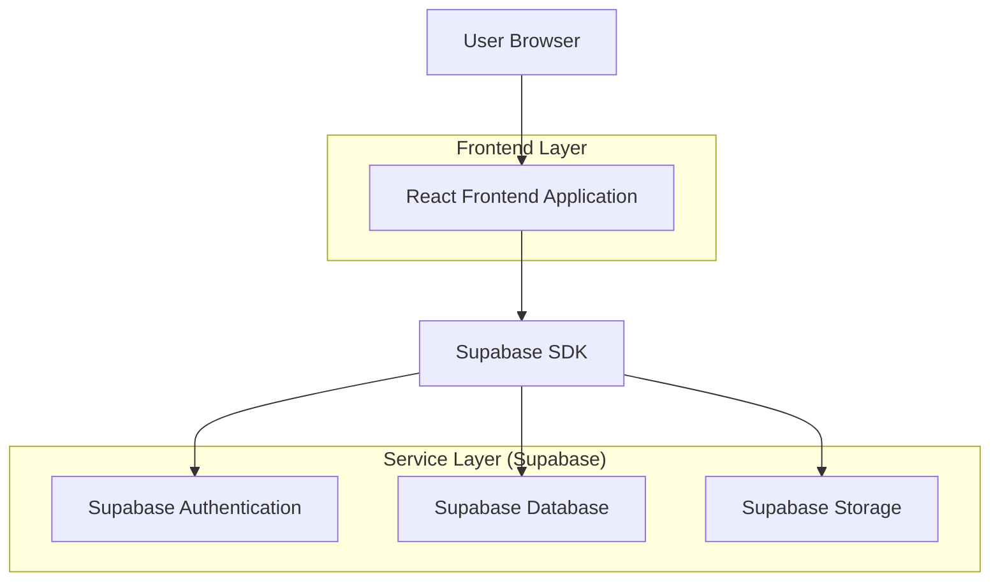
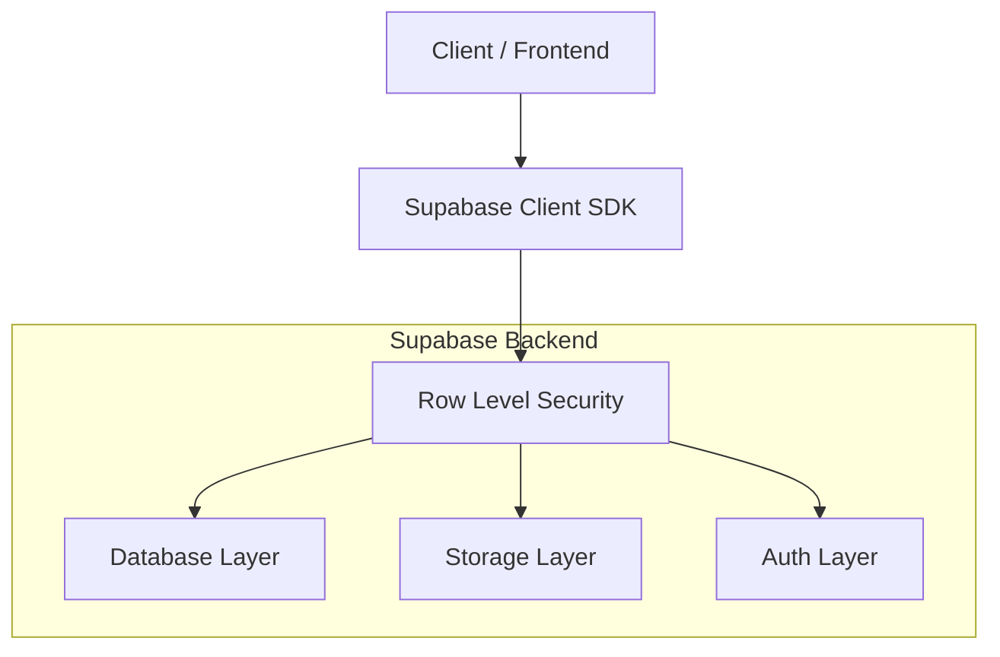
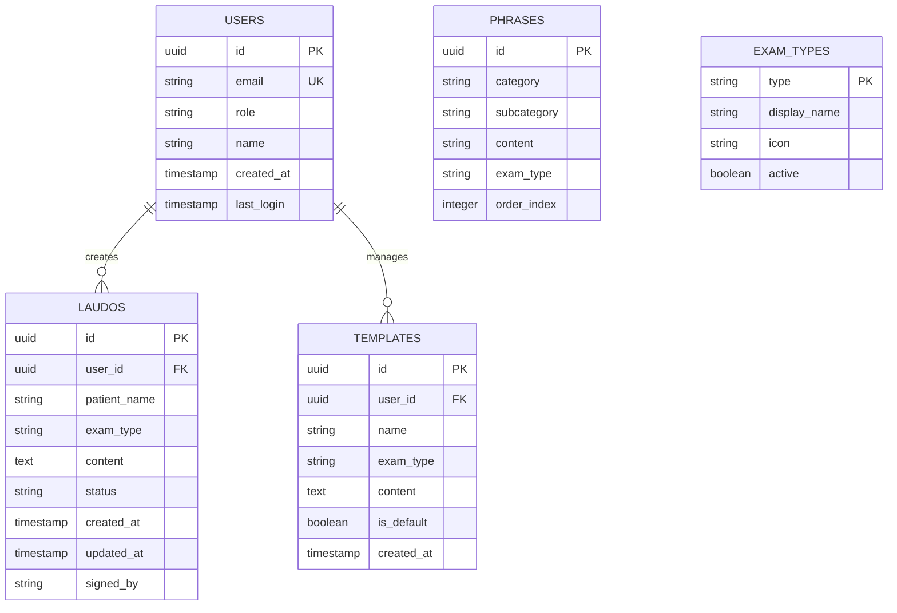

## 1. Architecture design



## 2. Technology Description
- Frontend: React@18 + TypeScript@5 + tailwindcss@3 + vite@4
- Backend: Supabase (BaaS)
- Database: PostgreSQL (via Supabase)
- Authentication: Supabase Auth
- Storage: Supabase Storage (para documentos PDF)
- Rich Text Editor: TipTap@2
- UI Components: HeadlessUI + Heroicons

## 3. Route definitions
| Route | Purpose |
|-------|---------|
| /login | Página de autenticação com validação de credenciais |
| /dashboard | Dashboard principal com cards de tipos de exames |
| /laudos/novo/:examType | Editor de laudos para novo exame |
| /laudos/editar/:id | Editor de laudos para laudo existente |
| /laudos/historico | Lista de laudos emitidos com filtros |
| /configuracao/templates | Gestão de templates por tipo de exame |
| /configuracao/usuarios | Administração de usuários (admin only) |
| /configuracao/frases | Editor do banco de frases categorizadas |

## 4. API definitions
### 4.1 Authentication APIs
```
POST /auth/v1/token
```
Request:
```json
{
  "email": "radiologista@clinica.com",
  "password": "senha123",
  "type": "password"
}
```

### 4.2 Laudo Management APIs
```
GET /rest/v1/laudos?user_id=eq.{id}&order=created_at.desc
```
Response:
```json
[
  {
    "id": "uuid",
    "patient_name": "João Silva",
    "exam_type": "tomografia",
    "content": "Laudo completo...",
    "status": "finalizado",
    "created_at": "2024-01-15T10:30:00Z",
    "updated_at": "2024-01-15T10:45:00Z"
  }
]
```

```
POST /rest/v1/laudos
```
Request:
```json
{
  "patient_name": "Maria Santos",
  "exam_type": "mamografia",
  "content": "Laudo detalhado...",
  "status": "rascunho"
}
```

### 4.3 Template APIs
```
GET /rest/v1/templates?exam_type=eq.{type}
```
Response:
```json
[
  {
    "id": "uuid",
    "name": "Template Padrão Tomografia",
    "exam_type": "tomografia",
    "content": "Estrutura do laudo...",
    "is_default": true
  }
]
```

## 5. Server architecture diagram


## 6. Data model

### 6.1 Data model definition


### 6.2 Data Definition Language

Users Table (users)
```sql
-- create table
CREATE TABLE users (
    id UUID PRIMARY KEY DEFAULT gen_random_uuid(),
    email VARCHAR(255) UNIQUE NOT NULL,
    role VARCHAR(50) NOT NULL CHECK (role IN ('radiologista', 'revisor', 'administrador')),
    name VARCHAR(255) NOT NULL,
    created_at TIMESTAMP WITH TIME ZONE DEFAULT NOW(),
    last_login TIMESTAMP WITH TIME ZONE,
    updated_at TIMESTAMP WITH TIME ZONE DEFAULT NOW()
);

-- enable RLS
ALTER TABLE users ENABLE ROW LEVEL SECURITY;

-- policies
CREATE POLICY "Users can view own profile" ON users FOR SELECT USING (auth.uid() = id);
CREATE POLICY "Admin can manage all users" ON users FOR ALL USING (auth.jwt() ->> 'role' = 'administrador');
```

Laudos Table (laudos)
```sql
-- create table
CREATE TABLE laudos (
    id UUID PRIMARY KEY DEFAULT gen_random_uuid(),
    user_id UUID NOT NULL REFERENCES users(id) ON DELETE CASCADE,
    patient_name VARCHAR(255) NOT NULL,
    exam_type VARCHAR(50) NOT NULL,
    content TEXT NOT NULL,
    status VARCHAR(20) NOT NULL CHECK (status IN ('rascunho', 'finalizado', 'revisado')),
    signed_by VARCHAR(255),
    created_at TIMESTAMP WITH TIME ZONE DEFAULT NOW(),
    updated_at TIMESTAMP WITH TIME ZONE DEFAULT NOW()
);

-- indexes
CREATE INDEX idx_laudos_user_id ON laudos(user_id);
CREATE INDEX idx_laudos_exam_type ON laudos(exam_type);
CREATE INDEX idx_laudos_created_at ON laudos(created_at DESC);
CREATE INDEX idx_laudos_status ON laudos(status);

-- enable RLS
ALTER TABLE laudos ENABLE ROW LEVEL SECURITY;

-- policies
CREATE POLICY "Users can view own laudos" ON laudos FOR SELECT USING (auth.uid() = user_id);
CREATE POLICY "Users can create own laudos" ON laudos FOR INSERT WITH CHECK (auth.uid() = user_id);
CREATE POLICY "Users can update own laudos" ON laudos FOR UPDATE USING (auth.uid() = user_id);
```

Templates Table (templates)
```sql
-- create table
CREATE TABLE templates (
    id UUID PRIMARY KEY DEFAULT gen_random_uuid(),
    user_id UUID REFERENCES users(id) ON DELETE CASCADE,
    name VARCHAR(255) NOT NULL,
    exam_type VARCHAR(50) NOT NULL,
    content TEXT NOT NULL,
    is_default BOOLEAN DEFAULT FALSE,
    created_at TIMESTAMP WITH TIME ZONE DEFAULT NOW(),
    updated_at TIMESTAMP WITH TIME ZONE DEFAULT NOW()
);

-- indexes
CREATE INDEX idx_templates_exam_type ON templates(exam_type);
CREATE INDEX idx_templates_user_id ON templates(user_id);

-- enable RLS
ALTER TABLE templates ENABLE ROW LEVEL SECURITY;

-- policies
CREATE POLICY "Users can view exam templates" ON templates FOR SELECT USING (true);
CREATE POLICY "Admin can manage all templates" ON templates FOR ALL USING (auth.jwt() ->> 'role' = 'administrador');
```

Phrases Table (phrases)
```sql
-- create table
CREATE TABLE phrases (
    id UUID PRIMARY KEY DEFAULT gen_random_uuid(),
    category VARCHAR(100) NOT NULL,
    subcategory VARCHAR(100),
    content TEXT NOT NULL,
    exam_type VARCHAR(50) NOT NULL,
    order_index INTEGER DEFAULT 0,
    created_at TIMESTAMP WITH TIME ZONE DEFAULT NOW()
);

-- indexes
CREATE INDEX idx_phrases_category ON phrases(category);
CREATE INDEX idx_phrases_exam_type ON phrases(exam_type);
CREATE INDEX idx_phrases_order ON phrases(order_index);

-- enable RLS
ALTER TABLE phrases ENABLE ROW LEVEL SECURITY;

-- policies
CREATE POLICY "All users can view phrases" ON phrases FOR SELECT USING (true);
CREATE POLICY "Admin can manage phrases" ON phrases FOR ALL USING (auth.jwt() ->> 'role' = 'administrador');
```

Exam Types Table (exam_types)
```sql
-- create table
CREATE TABLE exam_types (
    type VARCHAR(50) PRIMARY KEY,
    display_name VARCHAR(100) NOT NULL,
    icon VARCHAR(50) NOT NULL,
    active BOOLEAN DEFAULT TRUE,
    created_at TIMESTAMP WITH TIME ZONE DEFAULT NOW()
);

-- initial data
INSERT INTO exam_types (type, display_name, icon) VALUES
('ultrassonografia', 'Ultrassonografia', 'waveform'),
('tomografia', 'Tomografia', 'cube'),
('mamografia', 'Mamografia', 'heart'),
('raio-x', 'Raio-X', 'x-circle'),
('ressonancia', 'Ressonância Magnética', 'magnet');
```

### 6.3 Security & Compliance Configuration
```sql
-- Grant basic read access to anon role
GRANT SELECT ON exam_types TO anon;

-- Grant full access to authenticated role
GRANT ALL PRIVILEGES ON ALL TABLES IN SCHEMA public TO authenticated;
GRANT ALL PRIVILEGES ON ALL SEQUENCES IN SCHEMA public TO authenticated;

-- Create audit trigger for laudos
CREATE OR REPLACE FUNCTION audit_laudos_changes()
RETURNS TRIGGER AS $$
BEGIN
    IF TG_OP = 'UPDATE' THEN
        INSERT INTO audit_log (table_name, operation, old_data, new_data, user_id, created_at)
        VALUES ('laudos', 'UPDATE', row_to_json(OLD), row_to_json(NEW), auth.uid(), NOW());
        RETURN NEW;
    END IF;
    RETURN NULL;
END;
$$ LANGUAGE plpgsql;

CREATE TRIGGER trigger_audit_laudos
    AFTER UPDATE ON laudos
    FOR EACH ROW
    EXECUTE FUNCTION audit_laudos_changes();
```