# RadReport - Documentação de Implementação

## Visão Geral

Este documento descreve a implementação completa do sistema de autenticação do RadReport, incluindo:

- **Autenticação nativa Supabase** com Google OAuth
- **Google One-Tap** com FedCM (Federated Credential Management)
- **Cloudflare Turnstile** como CAPTCHA alternativo inteligente
- **Sistema híbrido offline-first** com sincronização
- **JWT token management** com refresh automático
- **Row Level Security (RLS)** no PostgreSQL

## Estrutura do Projeto

```
RadReport/
├── src/                          # Frontend React
│   ├── components/
│   │   ├── GoogleOneTap.tsx     # Google One-Tap component
│   │   ├── GoogleLoginButton.tsx # Botão de login Google
│   │   ├── EmailVerificationNotice.tsx # Notificação de email
│   │   └── TurnstileWidget.tsx  # Componente Turnstile
│   ├── hooks/
│   │   └── useAuth.tsx          # Hook de autenticação
│   ├── lib/
│   │   └── supabase.ts          # Cliente Supabase
│   └── pages/
│       ├── AuthCallback.tsx     # Callback OAuth
│       ├── SignUp.tsx           # Registro com Turnstile
│       └── Login.tsx            # Login tradicional
├── api/                          # Backend Express
│   ├── routes/
│   │   └── turnstile.ts         # Rotas Turnstile
│   ├── utils/
│   │   └── turnstile.ts         # Validação server-side
│   └── server.ts                # Servidor Express
└── supabase/                     # Configurações Supabase
    └── migrations/              # Migrações SQL
```

## Configuração de Autenticação

### 1. Supabase Auth

**Arquivo:** `src/lib/supabase.ts`

```typescript
// Configuração do cliente Supabase com PKCE flow
export const supabase = createClient(supabaseUrl, supabaseAnonKey, {
  auth: {
    persistSession: true,
    autoRefreshToken: true,
    detectSessionInUrl: true,
    flowType: 'pkce', // PKCE flow para segurança aprimorada
    storage: localStorage,
    storageKey: 'radreport-auth-token',
    debug: true
  },
  global: {
    headers: {
      'x-application-name': 'radreport-app',
      'x-client-version': '1.0.0'
    }
  }
})
```

### 2. Google OAuth Integration

**Arquivos:**
- `src/components/GoogleOneTap.tsx` - One-Tap automático
- `src/components/GoogleLoginButton.tsx` - Botão manual
- `src/pages/AuthCallback.tsx` - Processamento OAuth

**Características principais:**
- **Nonce-based security** com SHA-256 hashing
- **FedCM support** para autenticação nativa do navegador
- **Automatic session management** com refresh tokens
- **Email verification detection** e notificação

### 3. Cloudflare Turnstile

**Arquivos:**
- `src/components/TurnstileWidget.tsx` - Componente React
- `api/utils/turnstile.ts` - Validação server-side
- `api/routes/turnstile.ts` - Endpoints API

**Implementação:**

```typescript
// Client-side component
<TurnstileWidget
  onSuccess={(token) => setTurnstileToken(token)}
  onError={(error) => setTurnstileError(error)}
  theme="auto"
  size="normal"
  language="pt-BR"
  appearance="interaction-only"
/>

// Server-side validation
export async function verifyTurnstileToken(
  token: string, 
  secretKey?: string,
  remoteIP?: string
): Promise<TurnstileValidationResult> {
  const response = await fetch('https://challenges.cloudflare.com/turnstile/v0/siteverify', {
    method: 'POST',
    headers: { 'Content-Type': 'application/x-www-form-urlencoded' },
    body: new URLSearchParams({
      secret: secretKey || process.env.TURNSTILE_SECRET_KEY,
      response: token,
      remoteip: remoteIP
    })
  })
  
  return await response.json()
}
```

## Fluxos de Autenticação

### 1. Registro com Turnstile

```mermaid
sequenceDiagram
    User->>Frontend: Preenche formulário
    User->>Turnstile: Completa verificação
    Turnstile->>Frontend: Retorna token
    Frontend->>API: POST /auth/register { email, password, name, turnstileToken }
    API->>Turnstile: Verifica token
    Turnstile->>API: Confirma validação
    API->>Supabase: Cria usuário
    Supabase->>User: Envia email confirmação
    API->>Frontend: Confirma registro
```



### 2. Login Google One-Tap

```mermaid
sequenceDiagram
    User->>Browser: Acessa página
    Browser->>Google: Solicita One-Tap
    Google->>User: Mostra popup One-Tap
    User->>Google: Seleciona conta
    Google->>Frontend: Retorna CredentialResponse
    Frontend->>Supabase: signInWithIdToken
    Supabase->>Frontend: Sessão autenticada
    Frontend->>Dashboard: Navega para /app
```



## Configuração de Ambiente

### Variáveis de Ambiente Necessárias

```bash
# Supabase Configuration
VITE_SUPABASE_URL=https://your-project.supabase.co
VITE_SUPABASE_ANON_KEY=your-anon-key
SUPABASE_SERVICE_ROLE_KEY=your-service-role-key

# Google OAuth Configuration
VITE_GOOGLE_AUTH_ENABLED=true
VITE_GOOGLE_CLIENT_ID=your-google-client-id

# Cloudflare Turnstile Configuration
VITE_TURNSTILE_SITE_KEY=your-turnstile-site-key
VITE_TURNSTILE_SECRET_KEY=your-turnstile-secret-key
TURNSTILE_SECRET_KEY=your-turnstile-secret-key

# API Configuration
VITE_API_BASE=http://localhost:8787/v1
```

### Configuração no Supabase Dashboard

1. **Authentication Settings:**
   - Enable Email confirmations (opcional)
   - Configure OAuth providers (Google)
   - Set redirect URLs: `http://localhost:5173/auth/callback`

2. **Google OAuth Setup:**
   - Client ID: `VITE_GOOGLE_CLIENT_ID`
   - Authorized redirect URIs: `https://your-project.supabase.co/auth/v1/callback`
   - JavaScript origins: `http://localhost:5173`

3. **Row Level Security (RLS):**
   ```sql
   -- Exemplo de política para tabela users
   CREATE POLICY "Users can view own profile" ON users
   FOR SELECT USING (auth.uid() = id);
   
   CREATE POLICY "Users can update own profile" ON users
   FOR UPDATE USING (auth.uid() = id);
   ```

## Segurança Implementada

### 1. Nonce-based Security

```typescript
// Geração de nonce criptograficamente seguro
const generateNonce = (): string => {
  const array = new Uint8Array(32)
  crypto.getRandomValues(array)
  return Array.from(array, byte => byte.toString(16).padStart(2, '0')).join('')
}

// Hash SHA-256 do nonce
const hashedNonce = await crypto.subtle.digest('SHA-256', 
  new TextEncoder().encode(nonce))
```

### 2. PKCE Flow

```typescript
// Proof Key for Code Exchange
const codeVerifier = generateCodeVerifier()
const codeChallenge = await generateCodeChallenge(codeVerifier)
```

### 3. Session Management

```typescript
// Monitoramento automático de sessão
const startSessionMonitoring = () => {
  const { data: { subscription } } = supabase.auth.onAuthStateChange(
    async (event, session) => {
      if (event === 'TOKEN_REFRESHED') {
        console.log('Token refreshed automatically')
      }
      if (event === 'SIGNED_OUT') {
        handleSignOut()
      }
    }
  )
  return () => subscription.unsubscribe()
}
```

## Melhores Práticas Implementadas

### 1. Error Handling

```typescript
// Tratamento compreensivo de erros
try {
  const { data, error } = await supabase.auth.signInWithPassword({ email, password })
  
  if (error) {
    // Mapeamento de erros para mensagens amigáveis
    const errorMessages = {
      'Invalid login credentials': 'Email ou senha incorretos',
      'Email not confirmed': 'Por favor, confirme seu email antes de fazer login',
      'Too many requests': 'Muitas tentativas. Tente novamente mais tarde'
    }
    
    throw new Error(errorMessages[error.message] || error.message)
  }
  
  return { success: true, data }
} catch (error) {
  console.error('Auth error:', error)
  return { success: false, error: error.message }
}
```

### 2. Loading States

```typescript
// Estados de carregamento com feedback visual
const [loading, setLoading] = useState(false)
const [status, setStatus] = useState<'idle' | 'processing' | 'success' | 'error'>('idle')

// Feedback visual durante processamento
{status === 'processing' && (
  <div className="flex items-center justify-center p-4">
    <div className="animate-spin rounded-full h-8 w-8 border-b-2 border-primary"></div>
    <span className="ml-2">Processando autenticação...</span>
  </div>
)}
```

### 3. Accessibility

```typescript
// ARIA labels e roles para acessibilidade
<input
  aria-invalid={!!emailError}
  aria-describedby={emailError ? 'emailHelp' : undefined}
  aria-label="Email address"
  required
  className="..."
/>

{emailError && (
  <div id="emailHelp" role="alert" className="text-red-500 text-sm">
    {emailError}
  </div>
)}
```

## Troubleshooting

### Problemas Comuns

1. **"Processando autenticação..." travado**
   - Verificar logs no console do navegador
   - Verificar se as URLs de redirecionamento estão configuradas corretamente no Supabase
   - Verificar se email confirmation está ativado/desativado conforme necessário

2. **Redirecionamento loop (login -> dashboard -> login)**
   - Verificar lógica de navegação no AuthCallback
   - Garantir que está usando React Router navigate() ao invés de window.location
   - Verificar se o usuário tem email confirmado

3. **Turnstile não carrega**
   - Verificar se a chave do site está configurada
   - Verificar se o domínio está autorizado no dashboard Cloudflare
   - Verificar bloqueadores de anúncios ou scripts

### Logs de Depuração

```typescript
// Logs detalhados para debugging
console.log('🔍 Auth state changed:', {
  event,
  session: !!session,
  user: session?.user?.email,
  emailVerified: !!session?.user?.email_confirmed_at
})
```

## Próximos Passos

1. **Implementar rate limiting** nas APIs
2. **Adicionar 2FA** (Two-Factor Authentication)
3. **Implementar magic links** para login sem senha
4. **Adicionar social logins** adicionais (GitHub, Twitter)
5. **Implementar audit logs** para rastreamento de atividades
6. **Adicionar device management** para controle de sessões

## Referências

- [Supabase Auth Documentation](https://supabase.com/docs/guides/auth)
- [Google Identity Services](https://developers.google.com/identity/gsi/web)
- [Cloudflare Turnstile](https://developers.cloudflare.com/turnstile/)
- [PKCE Flow](https://oauth.net/2/pkce/)
- [FedCM API](https://developer.mozilla.org/en-US/docs/Web/API/FedCM_API)